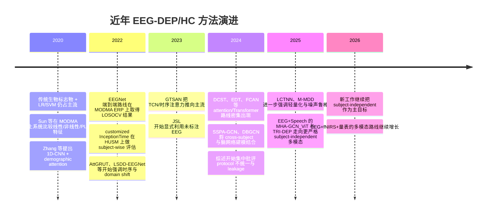
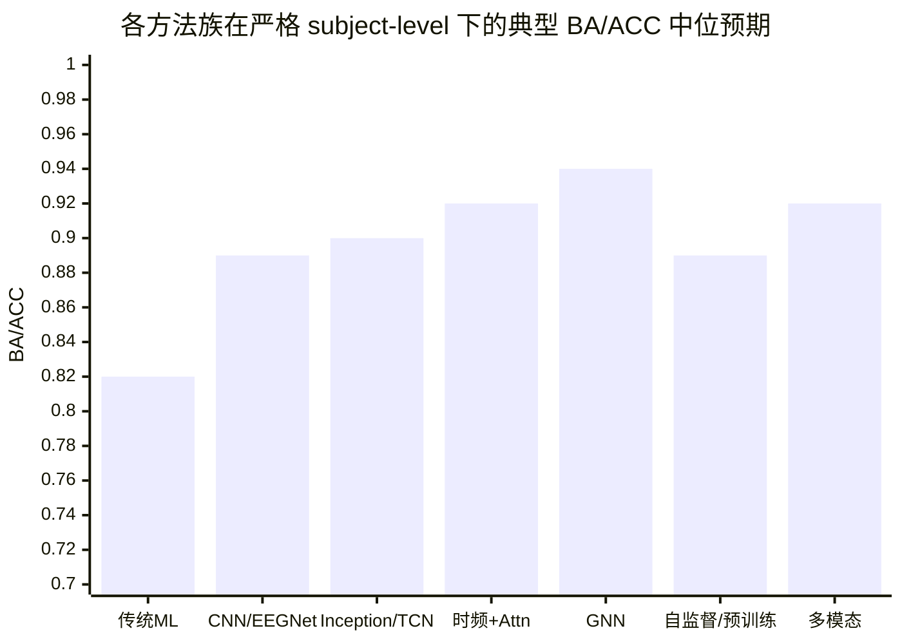

# EEG 进行 DEP 与 HC 被试类型分类的研究报告

## 执行摘要

过去五年，EEG 进行抑郁被试类型分类这条线，已经从“手工特征 + 传统分类器”的主导格局，快速转向了更强调 **subject-independent / subject-level** 评估的时序深度模型、注意力/Transformer、图神经网络，以及结合语音、文本或 fNIRS 的多模态方案。但这条赛道的一个核心现实没有改变：**公开数据集普遍偏小，窗口切分很容易制造 subject leakage，导致很多看起来极高的准确率并不等价于真实的跨被试泛化能力**。2024 年一篇 resting-state EEG 综述统计了 2018–2024 年 49 篇相关研究；2025 年两篇综述进一步强调，小样本、协议不统一、以及缺少严格 subject-wise 评估，仍然是当前证据链最薄弱的环节。citeturn13search19turn22search13turn31search10

如果你的目标是当前工程上“**特别好**”、同时又能较安全落地的方法，我的结论是：  
**短期最值得优先做** 的，不是最花哨的路线，而是三条：其一，**传统强基线**（PSD/频带功率、左右半球不对称、coherence/PLI、少量非线性特征 + 线性或 RBF-SVM）；其二，**轻量时序模型**（尤其是 InceptionTime/TCN 这一类）；其三，**轻量 attention/Transformer + 功能连接分支**（如 FCAN / DCST 这一思路）。这三类方法在小样本、严格 subject-level 5-fold 下，通常比“大而杂”的模型更稳定，也更容易做审计和复现实验。citeturn17view3turn17view4turn7view3turn10view2

从“学界当前最强”角度看，**GNN / 脑网络路线** 是目前最值得认真对待的方向之一。原因不是它在论文里“数值最高”这么简单，而是它更贴近 EEG 的空间拓扑与功能连接结构，而且已有若干工作明确采用了 **subject-level / cross-subject** 评估。尤其是 DBGCN 这类把时间频率复杂度、BiLSTM 时间建模与 GCN 空间拓扑结合起来的方法，在 MODMA 与 PRED+CT 上给出了非常高的 subject-level 结果；SSPA-GCN 与 HybGNN 则继续往“subject-invariant / domain generalization / individualized graph”推进。只是必须强调：**这些高分多数仍然来自小公开数据集，不能直接等同于跨中心、跨设备、跨任务的临床可用性**。citeturn28view2turn28view3turn26view0turn30view0

对你这种要落到现有工程仓库的人来说，最合理策略不是直接上大模型或多模态，而是先建立一套 **不污染主线、可审计、可复现** 的 subject-level protocol：先用传统 ML 和轻量时序模型把“无泄漏基线”跑稳，再做 FCAN/DCST/轻量 GNN 的 P2 轻量实验，最后才考虑 M-MDD 一类带噪声鲁棒多任务学习，或者脑电预训练/多模态路线。否则，工程上最常见的失败不是“模型太弱”，而是 **分割协议错了、归一化泄漏了、overlap window 漏了、或者把 emotion 任务的旧代码路径误复用到 subject-type 分类**。citeturn38view3turn33view1turn10view2turn28view2

## 方法全景与时间线

从方法谱系上看，DEP vs HC 的 EEG 分类大致有七条主线：  
一条是 **传统特征 + ML**，强调频带功率、左右半球不对称、功能连接和非线性特征；一条是 **CNN/EEGNet 类**，强调轻量端到端卷积；一条是 **时序模型**，包括 InceptionTime、TCN 及其变体；一条是 **时频 + Transformer / attention**，把频带分解、空间注意力和长程依赖结合；一条是 **GNN/脑网络**，显式建图；一条是 **自监督/预训练**，解决标签稀缺与噪声鲁棒；最后一条是 **多模态**，把 EEG 同语音、文本或 fNIRS 合并。近年的明显趋势，是越来越多论文把“是否严格 subject-independent”当成主要卖点，而不是只追求窗口级高准确率。citeturn13search19turn22search13turn31search10turn4search0



上面的时间线并不是“谁分数最高”的排行榜，而是更接近方法论的迁移方向：**传统手工特征没有消失，而是在严格 protocol 下重新变成很强的 sanity baseline；真正往前推进的，是能在小样本 subject-level 上保持稳定的轻量时序建模、结构化 attention，以及图建模**。citeturn17view0turn21view1turn17view3turn7view3turn10view2turn26view0turn28view3turn33view1turn38view3turn39search0turn39search1

## 方法分型与代表论文

### 传统特征与机器学习

这一路线的核心优势一直是 **解释性强、数据需求低、临床沟通成本小**。典型输入包括频带功率、左右半球不对称、功能连接指标如 coherence / PLI，以及样本熵、分形维数等非线性特征，再接 LR、SVM、kNN、NB 或树模型。对于 19 通道或 32 通道的小数据集，它仍然是最值得先做的基线。Sun 等在 MODMA 上比较了线性、非线性与 PLI 特征组合，表明 PLI + LR 以及多特征融合能把准确率推到约 82% 左右；而 HUSM 这类 19 通道数据上，Mumtaz 一系的 wavelet/特征选择 + LR 方案在公开综述与后续复现实验中仍被当作标准基线反复引用。citeturn28view3turn17view0

它的硬伤也很明确：**对预处理、特征工程和窗口定义极其敏感**，并且当你切到严格 subject-level split 时，性能上限通常会比端到端空间-时序模型低。但恰恰因为它简单透明，能够快速暴露数据与 protocol 的问题，所以我认为它不是“落后路线”，而是**所有新模型前必须先跑稳的审计底座**。citeturn22search13turn31search10turn13search19

### CNN 与 EEGNet 类

CNN/EEGNet 类方法的价值，在于它们提供了 **参数量可控、能够直接吃原始或轻度预处理 EEG 的端到端框架**。Liu 等 2022 年基于 EEGNet 的 MODMA ERP 工作，是这一类里较有代表性的研究：使用 128 通道、250 Hz 的 ERP 数据，在 leave-one-subject-out cross-validation 下做 end-to-end 分类，报出约 90.98% 的准确率，并指出不同情绪刺激条件中 happy-neutral 配对更容易区分 DEP 与 HC。citeturn21view1

与之相邻的路线还包括 Song 等的 LSDD-EEGNet，它在 CNN/LSTM 特征提取后显式加入 domain discriminator 来处理训练集和测试集之间的特征漂移；以及更早一些的 demographic-attention 1D-CNN，把年龄和性别一并融入网络表示。前者的重要性在于它把“**domain shift / subject shift**”摆到了台面上，后者的意义在于提醒我们：**被试人口统计学差异，在 DEP vs HC 任务里经常不是噪声，而是 confound 和可利用信息的混合体**。不过，这一类论文里有相当一部分没有在开放摘要中完整披露 subject-level 协议和最终 subject-level 指标，所以工程上应谨慎把它们当作可直接复用的强结论。citeturn20search0turn25view0

### 时序模型与 InceptionTime / TCN

如果只让我在小样本 EEG 上选一种“**工程收益比最高**”的深度路线，我会优先看 **InceptionTime / TCN**。原因很简单：它们比 Transformer 更稳、比纯 CNN 更擅长建模多尺度时间依赖，而且对于 19–32 通道、200–256 Hz、几秒到几分钟时长的输入很自然。Rafiei 等 2022 年在 HUSM 上把 customized InceptionTime 用到 19 通道原始 EEG，做了 **subject-wise partition + 10-fold CV**，在完整 19 通道输入上约 91% 准确率，只用 eyes-closed 记录时可到约 92.7%，而且他们还展示了 10 通道裁剪后性能只小幅下降。citeturn17view0turn17view1turn17view3turn17view4

同属这一路线的还有 2023 年的 GTSAN，它在原论文摘要里明确写了“改进的 TCN + separable convolution + attention”设计；在后续 DBGCN 的严格 subject-level 重实现比较中，GTSAN 在 MODMA 和 PRED+CT 上分别大约达到 97.56% 和 96.03% 的准确率。另一方面，AttGRUT 这类 Conv1D + Transformer + GRU 的时间序列模型，在 60 通道特征输入上可报到 98.67% 的高精度，但公开摘要没有足够清楚地说明 subject-level 划分，因此更适合作为“上界提示”，而不是直接作为你工程预期的现实区间。citeturn15view1turn28view3turn19view0

### 时频信息与 Transformer / Attention

这一类方法之所以在 2024–2025 年迅速增多，是因为研究者逐渐意识到：**抑郁 EEG 不只是时间序列问题，也不只是空间拓扑问题，而是频率、空间和时间三者耦合的问题**。EDT 把频带分解与 CNN + attention 结合起来；DCST 把脑区空间分布嵌进结构设计；FCAN 则直接把 EEG 与 coherence matrix 联合送入轻量 attention 模块。citeturn7view4turn7view3turn10view2

这条线里，**最有工程现实感** 的我认为是 FCAN 和 DCST。DCST 在公开摘要中明确使用 leave-one-subject-out cross-validation，报告 89.8% 的最高分类准确率；FCAN 在 HUSM 的 49 名 subjects、19 通道、256 Hz、4 分钟 eyes-closed 数据上，先切成 48 个不重叠 5 秒段，再做**基于 subject 的 10-fold**，其中每折 subject 不重叠，最终报告 95.20% ± 3.99% 准确率。FCAN 之所以值得重视，不只是分数，而是它把 **功能连接矩阵** 显式合进模型，同时仍保持“轻量 attention”而不是重型 Transformer。相对地，EDT 与 LCTNN 都很有潜力，但开放摘要对 split 和最终 subject-level 细节披露不够完整，所以更适合列为“值得复现验证”的候选，而不是你当前最先下注的路线。citeturn7view3turn10view0turn10view1turn10view2turn8view8turn7view4turn8view2turn7view2

### GNN 与脑网络

GNN/脑网络路线是目前学界最像“**下一代主线**”的方向。原因不是 GNN 天然更强，而是 EEG 天生带有电极图结构、通道相关性以及功能连接网络，DEP 与 HC 差异常常正体现在这种拓扑关系中。2024 年的 SSPA-GCN 在两个公开数据集上做 cross-subject depression detection，引入 secondary subject partitioning 与 attention mechanism，报告 92.87% 和 83.17% 的准确率；同年的 DBGCN 则把 DE 时间频复杂度、BiLSTM 和 GCN 结合，在 MODMA 与 PRED+CT 上用**subject-level 10-fold**获得 98.30% 与 96.51% 的准确率。citeturn26view0turn28view3turn28view2

更进一步的 HybGNN 把 depression 患者的“共同异常”和“个体化异常”拆成 common graph 与 individualized graph 两个分支，再用层级信息融合模块整合，在 MODMA 与 HUSM 上采用 **subject-exclusive 10-fold**，并公开了代码。这个方向非常接近你实际会想做的东西：它既不像传统 FC 特征那样手工，也不像黑箱 Transformer 那样太难解释；同时，还能在可视化里回到前额叶、顶叶、中央区这些脑区层面的重要性。它的主要问题只有一个：**图的构造方法、节点特征和边定义对结果影响非常大**，而且在 19 通道数据上，图太复杂时很容易过拟合。citeturn30view0

### 自监督与预训练

这一类方法从学术上非常重要，但对 DEP vs HC 的公开证据还明显 **少于 GNN 和轻量时序模型**。2023 年的 JSL 已经开始明确提出“用未标注 EEG 缓解标签稀缺”；2025 年的 M-MDD 进一步把 **contrastive noise robustness task** 和监督的时间-频谱-空间特征提取做成多任务联合训练，并明确声称在两个公开 MDD 数据集上采用了 **subject-independent cross-validation**。这说明领域已经从“只要深度学习就行”转向“**如何在噪声、标签稀缺和跨被试差异下学到更稳健表示**”。citeturn35search2turn33view1turn36view4

但就你当前要落地的单仓库实验而言，这一类路线更像 **中长期方向**。原因有二。第一，公开摘要里常常没有完整给出可直接对比的 subject-level 数值和全部训练细节。第二，真正发挥预训练优势通常需要更大规模未标注 EEG 语料，或者至少要接住通用 EEG foundation model。像 LEAD 这样的 foundation model 工作，已经证明了“**临床 EEG 上，域相关自监督预训练 + 严格 subject-independent fine-tuning**”是有效路线；TRI-DEP 则进一步把 LaBraM、CBraMod 这类脑电预训练表示直接迁移到 depression multimodal benchmark。我的判断是：**这条线未来很强，但你现在做单次 5-fold subject-level 实验时，不该把它当第一梯队的交付目标，而应当把它当 P3 研究向分支**。citeturn33view2turn38view3

### 多模态

多模态之所以越来越热，不是因为 EEG 不够用，而是因为 depression 本身就是多维表型。MODMA 提供了 EEG 与访谈音频，因此 EEG + speech 的研究在 2024–2026 年快速增加；更新的工作还把 text、fNIRS，甚至量表信息一并纳入。2025 年的 MHA-GCN_ViT 用 EEG 与 speech 组合做 depression detection；TRI-DEP 则显式比较 EEG、speech、text 的单模态、双模态与三模态，并把 **subject-independent splits** 作为 benchmark 基础；2026 年的 EEG-fNIRS-SDS 进一步把脑电、近红外和量表融合。citeturn39search0turn38view3turn39search1

但从工程角度，这一类方法的前提非常苛刻：你必须有同步或至少可对齐的多模态数据，且缺失模态、访谈长度差异、对齐粒度、融合位置都会成为主要误差源。也正因为如此，**多模态很适合长期研究与发表，但未必适合作为你当前仓库里最先接入的最小可行实验**。如果你手头只有 EEG，或者任务目标仅仅是 DEP vs HC 二分类，这条线应放在 GNN / 多任务路线之后。citeturn38view3turn39search0turn39search1

### 代表论文与关键信息速查表

下面这张表尽量只保留对工程最有用的信息。需要特别说明：很多论文只公开了 **accuracy** 而没有 **balanced accuracy**；在 HUSM、MODMA 这类类别相对接近平衡的数据上，可以把 ACC 近似当作 BA 来看，但它们仍不是严格同义。对于开放摘要无法完整确认 split 的论文，我已明确标注“未完整公开/需复验”。

| 方法族 | 代表论文 | 输入与数据 | 关键实验设置 | split 策略 | 公开结果 | 备注 | 来源 |
|---|---|---|---|---|---|---|---|
| 传统特征+ML | Mumtaz 系 wavelet + 特征选择 + LR | HUSM，34 MDD + 30 HC，19 通道，256 Hz，EO/EC resting | 选取前两分钟 EO/EC，wavelet 特征 + LR | 10-fold CV | ACC 87.5%，SE 95%，SP 80% | 经典强基线；可解释性高 | citeturn17view0turn17view3 |
| 传统特征+ML | Sun et al. 2020 resting-state biomarkers | MODMA，24 MDD + 29 HC，128 通道，250 Hz | 线性/非线性/PLI + LR/NB/kNN 比较 | 原文在此未完整展开；按 subject 特征比较 | PLI+LR 约 82.03%，ALL+LR 约 82.31% | 适合做传统强基线参考 | citeturn28view3 |
| CNN/EEGNet | Liu et al. 2022 EEGNet | MODMA ERP，24 MDD + 29 HC，128 通道，250 Hz | dot-probe 任务，按 Hcue/Fcue/Scue 分实验 | LOSOCV | ACC 90.98%，并给出 Precision/Recall/F1/Kappa；Hcue 最优 | 公开 protocol 较清楚 | citeturn21view1 |
| CNN/EEGNet | Zhang et al. 2020 1D-CNN + demographic attention | 170 subjects，81 DEP + 89 HC | 1D-CNN 融合年龄/性别注意力 | 开放摘要未完整披露 | 报告优于不带人口统计信息的 CNN | 经典 CNN 路线，适合当“加入 confound”的对照 | citeturn25view0 |
| CNN/EEGNet | LSDD-EEGNet 2022 | EEG + domain discriminator | CNN/LSTM 特征提取 + 域判别器 | 强调 train-test feature shift | 开放摘要未完整披露最终数值 | 重要点在“处理 domain shift” | citeturn20search0 |
| 时序 Inception/TCN | Rafiei et al. 2022 customized InceptionTime | HUSM，34 MDD + 30 HC，19 通道，256 Hz，resting EO/EC | 4 分钟原始 EEG；还测试 10 通道裁剪 | subject-wise partition + 10-fold CV | full 19ch 约 91%；仅 EC 约 92.7% | 小样本工程落地性很强 | citeturn17view0turn17view1turn17view3turn17view4 |
| 时序 Inception/TCN | GTSAN 2023 | EEG + 改进 TCN/attention | causal/dilated/separable conv，多尺度时序特征 | 原文摘要未披露严格 split；后续严格重实现可比较 | 在 DBGCN 统一 subject-level 重实现中：MODMA 97.56%，PRED+CT 96.03% | 原法重要；但建议按严格重实现复现 | citeturn15view1turn28view3 |
| 时序 Inception/TCN | AttGRUT 2022 | 60 通道统计/谱/小波特征 | Conv1D-Transformer 单元 + 双 GRU | 开放摘要未完整披露 | ACC 最高 98.67% | 数值高，但 subject leakage 风险需复查 | citeturn19view0 |
| 时频+Transformer/attention | DCST 2024 | EEG 空间分区 + attention | RegionalCalculationNet + GlobalCalculationNet | LOSO | ACC 89.8% | 强调电极空间分布 | citeturn7view3 |
| 时频+Transformer/attention | EDT 2024 | 频带分解后的 EEG | CNN + attention，显式建模 frequency/spatial/temporal | 10-fold CV | ACC 92.25 ± 4.83% | split 细节在开放摘要不够完整 | citeturn7view4turn8view2 |
| 时频+Transformer/attention | FCAN 2024 | HUSM 49 subjects，19 通道，256 Hz，EEG + coherence matrix | ICA + CAR + 0.5–45 Hz；4 分钟切 48 个不重叠 5 s 段 | **按 subject 划分的 10-fold** | ACC 95.20 ± 3.99% | 轻量 attention + FC，非常值得复现 | citeturn10view0turn10view1turn10view2turn8view8turn9view3 |
| 时频+Transformer/attention | LCTNN 2025 | 两个 MDD 数据集 | CNN + sparse attention + attention pool + channel modulator | 开放摘要未完整披露 | 号称在多数指标上 SOTA | 可列入候选，但先不要当首选 | citeturn7view2 |
| GNN/脑网络 | SSPA-GCN 2024 | MODMA + PRED+CT | attention + SSP domain generalization | **cross-subject** | 两公开集分别 92.87% / 83.17% | 重要在跨被试域泛化思想 | citeturn26view0 |
| GNN/脑网络 | DBGCN 2024 | MODMA 53 subjects 128ch 250Hz；PRED+CT 119 subjects 64ch 500Hz | 122 s 连续片段，4 s 窗、50% overlap；DE + BiLSTM + GCN | **按 subject 10-fold，不混 subject 段** | MODMA 98.30%，PRED+CT 96.51% | 目前公开文献里非常强，但仍需防“小数据高分”误导 | citeturn28view1turn28view2turn28view3 |
| GNN/脑网络 | HybGNN 2024 | MODMA + HUSM；统一用 19 通道 | 4 s 不重叠切段；common + individualized graph；公开代码 | **10-fold，subject 互斥** | 开放片段显示 consistently outperforms baselines | 有代码，适合作为中长期复现对象 | citeturn30view0 |
| 自监督/预训练 | JSL 2023 | EEG + unlabeled EEG | Joint semi-supervised learning | 开放摘要未完整披露 | 强调利用未标注数据缓解 label scarcity | 方向重要，但公开可比数值有限 | citeturn35search2turn35search5 |
| 自监督/预训练 | M-MDD 2025 | HUSM + Arizona2020 | Contrastive Noise Robustness Task + temporal/spectral/spatial multi-task | **subject-independent CV** | 开放摘要未给最终精确数值，但宣称 SOTA | 很值得跟进，偏中长期 | citeturn33view1turn36view0turn36view4 |
| 自监督/预训练 | LEAD / 脑电 foundation model | 大规模临床 EEG 预训练 | self-supervised pretrain + subject-independent fine-tune | 6:2:2 subject-independent split（foundation setting） | 非 depression 专项，但证明预训练可迁移 | 作为 DEP/HC 的中长期支撑技术 | citeturn33view2 |
| 多模态 | MHA-GCN_ViT 2025 | EEG + speech | EEG 图建模 + speech + ViT 融合 | 开放摘要未完整披露 split 细节 | 公开摘要称优于 baseline | 若有音频可做长期方向 | citeturn39search0turn39search4 |
| 多模态 | TRI-DEP 2025 | MODMA；EEG + speech + text | 比较 handcrafted 与 pretrained features；两种 EEG 预处理分支 | **subject-independent splits** | 公开摘要称 trimodal 达到 SOTA | 实验设计规范，适合未来 benchmark 化 | citeturn38view3 |
| 多模态 | EEG-fNIRS-SDS 2026 | EEG + fNIRS + 量表 | 多模态生理融合 | 开放摘要未完整披露 | 2026 新方向 | 设备负担高，适合后期 | citeturn39search1turn39search15 |

## 横向比较与判断

如果只从“论文数值”看，GNN、attention/Transformer 和多模态似乎最亮眼；但如果按你真正关心的五个维度来排——**小样本鲁棒性、subject-level split 鲁棒性、可解释性、复现成本、临床可用性**——排序会不一样。传统 ML 在这五维里并不落后，反而在可解释性与复现成本上长期占优；轻量 InceptionTime/TCN 在小样本和跨被试上往往更稳；FCAN/DCST 兼顾了性能与结构归因；GNN 的上限最高，但最依赖图构造质量；自监督/预训练与多模态最有长期潜力，但当前仍更像“研究资产”，而非一上来就能保交付的工程方案。citeturn17view3turn10view2turn26view0turn28view3turn33view1turn38view3

我特别想强调一个容易被忽视的判断标准：**论文里是否明确展示了 subject-wise / LOSO / subject-independent 协议**。在这点上，Rafiei 的 InceptionTime、Liu 的 EEGNet、DCST、FCAN、DBGCN、HybGNN、M-MDD、TRI-DEP 都比很多只给窗口级 10-fold 的工作更有参考价值。也正因此，我在下面的“典型 BA/AUC 范围”里，更看重这些严格协议工作，而不是单纯取最高分。citeturn17view3turn21view1turn7view3turn10view2turn28view2turn30view0turn36view4turn38view3

### 家族级对比表

| 方法族 | 典型输入 | 模型规模 | 样本需求 | 典型 subject-level BA/ACC 范围 | 典型 AUC 范围 | 最容易出问题的点 | 适用性判断 |
|---|---|---|---|---|---|---|---|
| 传统特征 + ML | PSD/DE/不对称/PLI/coherence/非线性特征 | 极小 | 低 | 0.75–0.88 | 0.82–0.95 | 特征工程过拟合；预处理一换就掉分 | **必须先做** 的审计基线 |
| CNN / EEGNet | 原始 EEG、ERP epoch、少量频域分支 | 小 | 低到中 | 0.85–0.92 | 约 0.90 左右 | 把 segment-level 结果误当 subject-level | 适合做第一层深度 baseline |
| InceptionTime / TCN | 原始多通道时序、PSD 序列 | 小到中 | 中 | 0.88–0.93 | 约 0.90–0.96 | overlap 窗和 subject split 混用 | **最推荐的短期深度路线** |
| 时频 + Transformer / attention | 频带分解 + 原始 EEG / coherence | 小到中 | 中 | 0.89–0.95 | 约 0.90–0.96 | hyperparameter 敏感；小样本不稳 | 若做轻量版，性价比很高 |
| GNN / 脑网络 | 节点特征 + 邻接矩阵/功能连接图 | 中 | 中到高 | 0.90–0.98 | 文中多报 ACC，AUC 较少完整给出 | 图构造随意；小样本高分幻觉 | **最值得中长期深挖** |
| 自监督 / 预训练 | 原始 EEG、多视图增广、预训练嵌入 | 中到大 | 需较多未标注数据 | 直接证据仍少；现实预期 0.84–0.93 | 待更多公开 benchmark | 预训练域不匹配；算力开销大 | 研究潜力大，短期不宜主攻 |
| 多模态 | EEG + speech/text/fNIRS/量表 | 中到大 | 中到高 | 0.88–0.95 | 通常优于单模态，但可比性差 | 对齐、缺模态、协议不统一 | 有数据时很强，否则先不接 |

上表中的区间是基于 **严格或相对严格 subject-level 文献结果** 做的工程归纳；其中不少论文仅公开 ACC，所以这里的“BA/ACC 范围”应理解为接近 BA 的现实可达区间，而不是统一协议下的排行榜。支撑这些区间判断的核心证据来自 HUSM 上的 subject-wise InceptionTime 与 FCAN、MODMA 上的 LOSOCV EEGNet、以及 MODMA/PRED+CT 上 subject-level 的 DBGCN 与 SSPA-GCN。citeturn17view3turn10view2turn21view1turn28view2turn28view3turn26view0



这张图不是“单篇 SOTA 结果图”，而是更偏向你要做实验规划时的 **现实中位预期**：传统 ML 给你可靠下限，Inception/TCN 和轻量 attention 往往最稳，GNN 上限最高但对 protocol 与图构造最敏感，自监督与多模态则更看资源与数据条件。citeturn17view3turn10view2turn28view3turn26view0turn33view1turn38view3turn39search0

## 可复现实验建议

我建议你把复现协议分成四层：**预处理、输入构造、subject-level CV、训练与评估审计**。真正决定结果是否可信的，往往不是网络，而是这四层是否自洽。HUSM/FCAN 一类工作通常做 CAR、0.5–45 Hz 滤波、ICA 去伪迹，并在剔除起始段后按固定窗口切分；Rafiei 的 InceptionTime 也显示 eyes-closed 通常比 eyes-open 更有利于抑郁分类；DBGCN/HybGNN 则进一步示范了如何在 subject-level 折内保留窗口，同时不让同一 subject 的重叠片段越过训练/测试边界。citeturn10view1turn17view4turn28view2turn30view0

### 数据预处理与输入构造

对于常见场景，我建议这样调：

| 场景 | 建议 |
|---|---|
| 19 通道，250–256 Hz，resting EO/EC | 先做传统基线和 InceptionTime / FCAN-lite；功能连接可优先用 coherence 或 Pearson corr；窗口 4–5 s，尽量不要跨 subject 混窗 |
| 32 通道，250–500 Hz | 可以安全上轻量 TCN、DCST-lite 或小型 GNN；若频率过高，先反走样后降采样到 200/250/256 Hz |
| 64–128 通道，250–500 Hz | 若样本量没有显著增加，不建议一开始就上大 Transformer；先做通道子集映射或图稀疏化，再上 GNN/attention |
| 500–1000 Hz 采样 | DEP vs HC 并不总需要这么高的时域分辨率；大多数文献在 250–500 Hz 范围内已经能提取有效频带与功能连接信息，建议降采样减轻计算量 |
| eyes-open 与 eyes-closed 同时存在 | 一定要先分开报告，再考虑合并；Rafiei 的结果明确显示 EC 通常更优，混合后虽然样本更多，但可能把状态差异当作病理差异 | 

这些建议与公开数据的设置是一致的：HUSM 常见为 19 通道、256 Hz；MODMA 为 128 通道、250 Hz；PRED+CT 为 64 通道、500 Hz；而一些最稳定的 subject-level 结果恰好都不是来自超大模型，而是来自对窗口长度、通道数和状态条件控制得比较清楚的实验。citeturn10view0turn17view1turn28view1turn17view4

### subject-level 交叉验证协议

建议默认采用 **StratifiedGroupKFold(n_splits=5)**，其中 `group=subject_id`，并把同一 subject 的所有 EO/EC/task、所有重叠与非重叠窗口、以及所有增强样本全部锁在同一 fold 里。外层 5-fold 只做最终评估；如果你要调参，再在训练 folds 内部用 grouped train/val 切分。不要把“从同一 subject 切出来的 4s/5s 窗口”当作相互独立样本去随机 10-fold。FCAN、DBGCN、HybGNN、TRI-DEP 这类更可信的工作，共同点正是**显式写出了 subject-exclusive / subject-based split**。citeturn10view2turn28view2turn30view0turn38view3


### baseline 实现建议

如果你的目标是“先把 protocol 跑稳”，我建议 baseline 至少有三条：

第一条是 **传统 ML baseline**：  
频带功率（δ/θ/α/β，必要时加 γ）+ 左右半球不对称 + coherence/PLI + 样本熵/近似熵中选若干稳特征，再接 **linear SVM / RBF-SVM / LR**。这个 baseline 的意义不是冲榜，而是验证数据是否真的携带 DEP/HC 信息。Sun 的 MODMA biomarker work、Mumtaz/HUSM 的 wavelet+LR，以及后续各类深度论文中的对比，说明这一路线在 0.8 左右 BA/ACC 并不罕见。citeturn28view3turn17view0

第二条是 **EEGNet or small 1D-CNN baseline**：  
如果是 ERP/事件相关范式，优先用 EEGNet；如果是 resting-state 连续信号，更建议上 small 1D-CNN 或 EEGNet 的时间版本。Liu 的 EEGNet 在 MODMA ERP 上给出 LOSOCV 90.98%，说明只要 protocol 正确，这条线可以很强。citeturn21view1

第三条是 **small InceptionTime / TCN baseline**：  
这是我最推荐的深度 baseline。配置简单，训练稳定，最能反映时序信息本身是否足以区分 DEP 与 HC。Rafiei 的结果已经证明，在 HUSM 这种 19 通道小数据上，subject-wise InceptionTime 完全能作为强基线。citeturn17view3turn17view4

### 训练细节

训练时我建议保持保守。二分类任务优先用 **weighted BCE / class-weighted cross-entropy**；优化器用 AdamW 或 Adam；early stopping 看 **validation BA 或 F1**，不要看 window-level training accuracy。M-MDD 明确把噪声鲁棒作为辅助任务，HybGNN/LEAD 等工作也都以交叉熵为核心损失，并把早停与 subject-independent 验证集绑定。实际工程中，保守的小增广就够了：小幅高斯噪声、振幅缩放、少量 channel dropout 即可，不要上会破坏病理差异的强增强。citeturn33view1turn30view0turn33view2

### 评估与审计清单

建议每次实验把下面六项和分数一起保存：

1. 每折的 **subject 列表**、DEP/HC 数量、EO/EC/task 分布。  
2. window-level 与 subject-level 两套指标，但以 **subject-level BA/ACC、AUC、F1、SE、SP** 为主。  
3. 归一化、特征选择、阈值选择是否 **只在训练折拟合**。  
4. 是否存在 overlap window 穿越 train/test 边界。  
5. 是否报告了多随机种子或至少固定 `seed=42` 的可重复结果。  
6. 是否输出了 channel / region 重要性，且该重要性在 5 folds 间是否稳定。  

这些要求并不花哨，但正是区分“可交付结果”和“漂亮但不可信结果”的核心。citeturn10view2turn28view2turn30view0turn38view3

### 可直接复制的最小实验配置清单

下面这个配置不是某一篇论文原封照搬，而是结合 FCAN、Rafiei-InceptionTime、EEGNet、HybGNN 等严格 protocol 工作抽象出来的**最小可行 subject-level 实验配置**。citeturn10view2turn17view3turn21view1turn30view0

```yaml
task:
  name: dep_hc_subject_cls
  target: subject_type
  labels: [HC, DEP]

data:
  dataset: AUTO
  channels: AUTO
  sampling_rate: AUTO
  condition: [eyes_closed]
  segment_seconds: 5
  segment_overlap: 0.0
  group_key: subject_id

preprocess:
  rereference: CAR
  bandpass_hz: [0.5, 45.0]
  notch_hz: 50
  ica: true
  drop_initial_seconds: 30
  downsample_to_hz: 250
  normalize: zscore_per_channel_fit_on_train_only

cv:
  outer_folds: 5
  splitter: StratifiedGroupKFold
  grouped_by: subject_id
  val_from_train: 0.2
  random_seed: 42

features_baseline:
  enabled: true
  bands: [delta, theta, alpha, beta]
  compute:
    - bandpower
    - frontal_asymmetry
    - coherence
    - sample_entropy
  selector:
    method: mrmr_or_rfe
    fit_on_train_only: true
  classifier:
    name: linear_svm
    class_weight: balanced

model_p1:
  name: inceptiontime_small
  in_channels: AUTO
  blocks: 3
  bottleneck: 32
  hidden_dim: 64
  dropout: 0.25

train:
  loss: weighted_bce
  optimizer: adamw
  lr: 0.001
  weight_decay: 0.0001
  batch_size: 32
  epochs: 100
  early_stop_metric: val_balanced_accuracy
  early_stop_patience: 15

metrics:
  primary: balanced_accuracy
  secondary: [auc, f1, sensitivity, specificity, mcc]

report:
  aggregate_subject_prediction: majority_vote
  save_fold_subject_lists: true
  save_confusion_matrix: true
  save_channel_importance: true
```

## 优先级与工程接入建议

先说结论：**不要一开始就把“最强方法”接进主仓库主线。** 你现在最该做的是建立一个和原任务彻底隔离的 `dep_hc_subject_cls` 分支任务，复用训练基础设施，但不要复用旧标签语义、旧 head、旧 sampler、旧评估脚本的任何隐式假设。以前做情绪正负判断的代码路径，和现在做 subject-type classification，本质上不是一个任务；如果不隔离 namespace，最容易出现“代码能跑，但结果语义错了”的假成功。

### 推荐优先级清单

下面的 BA 区间是我依据上文严格 subject-level 论文所做的**工程预期区间**，适用于你说的“single full 5-fold subject-level”这一设置，不是文献保证值。citeturn17view3turn10view2turn21view1turn28view3turn26view0turn33view1

| 优先级 | 路线 | 为什么先做/后做 | 单次完整 5-fold subject-level 合理预期 BA | 失败判据 |
|---|---|---|---|---|
| 短期可落地 | 手工特征 + linear/RBF-SVM | 最透明，最能暴露 protocol 问题 | 0.72–0.82 | BA < 0.68，或折间 std > 0.10 |
| 短期可落地 | small InceptionTime / TCN | 小样本最稳，训练简单，最适合 resting-state | 0.80–0.88 | 不超过 ML baseline 2 个点；或 EC/EO 混合后异常上升 |
| 短期可落地 | EEGNet / small 1D-CNN | 作为端到端 sanity deep baseline | 0.78–0.86 | 只在 window-level 好看，subject-level 无提升 |
| 中期潜力 | FCAN-lite / DCST-lite | 性能、结构归因、连接信息三者平衡 | 0.82–0.90 | attention 图无稳定脑区模式；训练对 seed 极敏感 |
| 中期潜力 | DBGCN / SSPA-GCN / HybGNN-lite | 最有望继续提高上限 | 0.84–0.92 | 图一换就崩；训练集很高、测试集波动极大 |
| 风险高但值得探索 | M-MDD 式多任务 / 轻量预训练迁移 | 抗噪与泛化潜力最好 | 0.84–0.91 | 相比同骨干 supervised 基线几乎无增益 |
| 风险高但值得探索 | EEG+speech / EEG+text / EEG+fNIRS | 有可能进一步提分，也更贴近临床表型 | 0.88–0.95（前提是模态齐全且协议严格） | 对齐成本极高；一旦去掉额外模态性能断崖下降 |

### 安全接入现有工程仓库的方式

我会建议你采用 **两阶段隔离接入**：

第一阶段是 **P1 seed42**，目标是做“协议验证 + 最小可行结果”。  
只放三件事：  
传统特征 + SVM、small InceptionTime、EEGNet。  
不允许引入任何旧任务 checkpoint，不允许把 segment sampler 与 subject sampler 混用，不允许写进主分支默认 config。P1 的目标不是冲高分，而是证明：**subject-level 评估路径完整无污染**。

第二阶段是 **P2 lightweight**，目标是做“结构增强但不重资产”。  
在 P1 基础上只新增一个轻量 attention/graph 路线，例如 FCAN-lite 或 tiny GNN。仍不接 foundation model，不接多模态，不接跨仓库复杂依赖。P2 的意义是判断：**在不显著增加维护成本的前提下，是否能稳定超过 P1。**

### gate 条件

我建议把以下 gate 写死，任何新方法不过 gate 就不允许并入主实验矩阵：

```yaml
gates:
  protocol:
    - no_subject_overlap_across_folds: true
    - no_train_fit_on_full_data: true
    - save_subject_lists_per_fold: true

  p1_accept:
    - strongest_baseline_mean_ba >= 0.72
    - fold_std_ba <= 0.10
    - subject_level_metric_is_primary: true

  p2_accept:
    - mean_ba_improvement_over_p1 >= 0.03
    - fold_std_ba_not_worse_than_p1_by_more_than: 0.02
    - no_single_fold_collapse_below: 0.60
    - channel_or_region_importance_stable_across_folds: true

  merge_blockers:
    - missing_subject_ids
    - random_window_split
    - reused_emotion_task_head
    - normalization_fit_on_all_subjects
    - report_only_window_accuracy
```

如果你要我只给一句最务实的工程建议，那就是：  
**先用 P1 把“没有 leakage 的 0.78–0.85 BA”做出来，比仓促得到一个不可审计的 0.93 更有价值。**

## 开放问题与主要参考来源

这份报告已经尽量优先使用原始论文、综述、公开数据集与可访问代码信息，但仍有几类信息在公开摘要层面 **不完整**：  
一是一些 2024–2026 模型论文没有在开放摘要中完整披露最终 subject-level AUC / BA 数值；二是少数工作虽然报出很高 accuracy，但没有在开放页面清楚写明 split 是否严格按 subject；三是多模态新作中，benchmark 协议仍在快速变化，因此不同论文之间的数字还不能直接并排当排行榜看。对这些部分，我在文中都明确标成了“未完整公开/需复验”，没有把它们伪装成强结论。citeturn19view0turn7view2turn39search0turn39search1

本报告最值得你优先回看的来源，按用途可分为四组：

**综述与全景**：  
2024 年 resting-state EEG depression diagnosis 综述，梳理了 2018–2024 年 49 项研究；2025 年系统综述与 Diagnostics 综合综述，总结了浅层、深层、协议与数据层面的主要问题。citeturn13search19turn22search13turn31search10

**小样本 subject-level 强基线与轻量深度路线**：  
Rafiei 2022 customized InceptionTime、Liu 2022 EEGNet、DCST 2024、FCAN 2024。它们共同的价值在于：公开协议相对清楚，且都更接近你当前工程复现实验需要的“严格 split + 小样本稳健”。citeturn17view3turn21view1turn7view3turn10view2

**GNN / 脑网络路线**：  
SSPA-GCN 2024、DBGCN 2024、HybGNN 2024。若你要中期追求更高上限，这组是最值得押注的。尤其 HybGNN 已给出公开代码线索。citeturn26view0turn28view3turn30view0

**中长期方向**：  
M-MDD 2025 的多任务抗噪路线；TRI-DEP 2025 的 subject-independent trimodal benchmark；以及 EEG foundation model/预训练相关工作如 LEAD。它们更适合作为主线稳定后再开的研究支线。citeturn33view1turn38view3turn33view2

综合起来，如果你现在就要开工，我的明确建议是：  
**先做 ML baseline → small InceptionTime/TCN → FCAN-lite / tiny GNN。**  
把这三层在 **single full 5-fold subject-level** 协议下跑稳之后，再决定是否上 M-MDD、预训练迁移或多模态。这样做，不仅最符合近五年文献里“真正可信”的方法演化方向，也最能保护你的工程主线不被一次不可靠的实验污染。